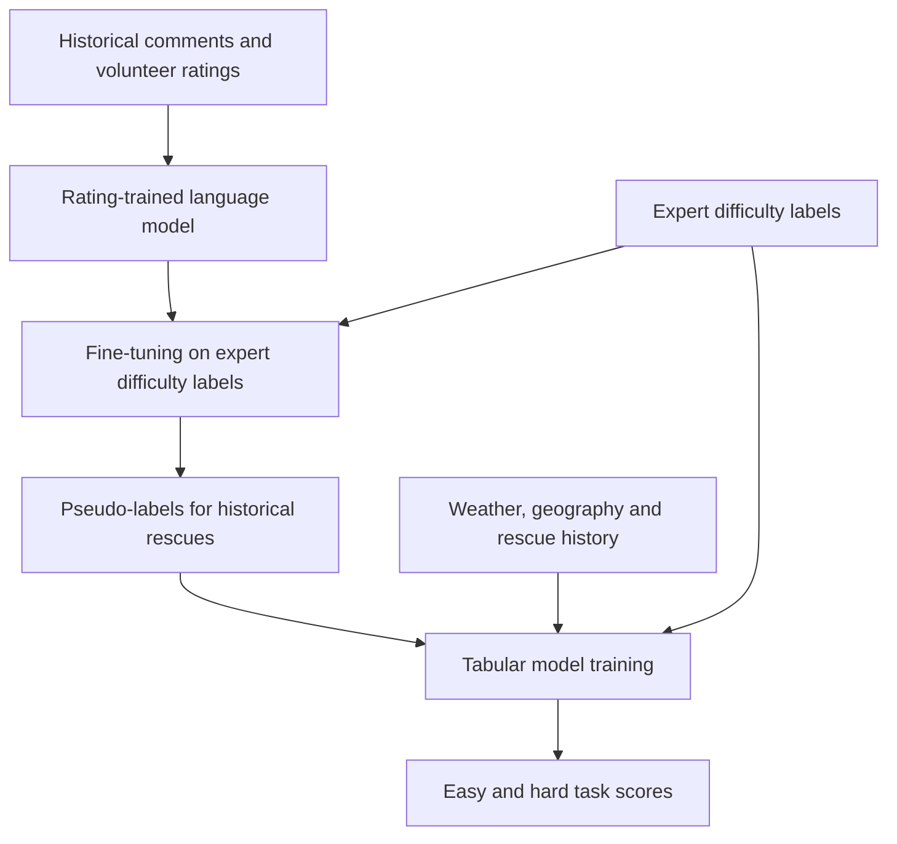

# Food Rescue Task Difficulty Prediction

**CS 1950 research capstone · University of Pittsburgh · Spring 2025**

**Mingyu (Lucas) Chen** · [LinkedIn](https://www.linkedin.com/in/lucas-chen-8b2226258/)

Food rescue volunteers collect donated food and deliver it to community organizations. This project explores how historical rescue records can help identify tasks that are likely to be easy or hard, so volunteers can make more informed choices.

This repository documents my capstone work in the Food Rescue AI Lab, supervised by **Dr. Zheyuan Ryan Shi**, in the context of the lab's collaboration with **Food Rescue Hero**. It includes research scripts, a cleaned feature-engineering notebook, my presentation and final report, and the underlying WWW 2024 paper.

**Project status:** historical research code with a working offline demo. Re-running the original experiments requires authorized access to the lab's PostgreSQL data and further review of the archived scripts. The included demo uses entirely synthetic data.

## My contribution

As described in my capstone report, my work focused on:

- Debugging the existing research code and resolving preprocessing and dependency issues.
- Cleaning and checking numeric and geographic features from PostgreSQL records.
- Comparing tabular models, including LightGBM, Random Forest, Logistic Regression, SVM, MLP, and KNN.
- Examining the text-based pseudo-labeling workflow and evaluating prediction quality with ROC-AUC, F1, accuracy, and PR-AUC.
- Investigating temporal behavior and the differences between local experiments and published results.

The original algorithm, stakeholder interviews, and explanation methods belong to the research team credited in the paper. I am the capstone student and repository maintainer, and I am not listed as an author of that publication. AWS integration is described as future work in my final report.

## Research approach

The paper defines two separate binary tasks: **easy versus other** and **hard versus other**. Its hybrid workflow uses volunteer comments to create additional training labels, then learns a predictor from tabular features available before a rescue.



Comments describe completed rescues. They support the training process; a new rescue's future comment must not be used as an input when predicting its difficulty. See [methodology](docs/methodology.md).

| Approach | Training information |
| --- | --- |
| Baseline 1 | Tabular features and expert difficulty labels |
| Baseline 2 | Language model trained directly on expert difficulty labels, followed by pseudo-labeling and tabular prediction |
| Hybrid research algorithm | Language model first trained on volunteer ratings, then difficulty labels, followed by pseudo-labeling and tabular prediction |

## Results and their sources

**Published paper results**, from Table 2 of Shi et al. (WWW 2024), averaged over 10 random seeds:

| Algorithm | Easy ROC-AUC, mean ± SD | Hard ROC-AUC, mean ± SD |
| --- | --- | --- |
| Baseline 1 | 0.543 ± 0.024 | 0.495 ± 0.025 |
| Baseline 2 | 0.709 ± 0.037 | 0.563 ± 0.000 |
| Hybrid research algorithm | **0.710 ± 0.023** | **0.685 ± 0.041** |

These are the original authors' results. They are not results reproduced by this repository or personal performance claims.

**My capstone report** records different local outcomes. Its LightGBM entries are summarized below:

| Approach | Easy ROC-AUC | Hard ROC-AUC | Report location |
| --- | --- | --- | --- |
| Baseline 1 | 0.692 | 0.405 | Section 4.3.1, p. 7 |
| Baseline 2, raw split | 0.703 | 0.356 | Section 4.3.2, p. 8 |
| Final algorithm, raw split | 0.703 | 0.356 | Section 4.3.3, p. 9 |

The report's Baseline 2 and final-algorithm tables contain identical numbers. The supplied archive does not include the experiment logs needed to establish whether those tables represent separate runs. No verified post-tuning metric is available in the supplied materials. See [results and limitations](docs/results.md).

## Run the offline demo

The demo is a small tabular classification example added for this repository. It does not train BERT, connect to a database, or reproduce the paper's hybrid model. It generates fictional rescue features, fits Logistic Regression and Random Forest for each binary task, chooses thresholds on validation data, and evaluates an untouched test set.

Use **Python 3.12** for the documented dependency versions:

```bash
python -m venv .venv
```

Activate the environment on Windows PowerShell:

```powershell
.\.venv\Scripts\Activate.ps1
```

Or on macOS/Linux:

```bash
source .venv/bin/activate
```

Then run:

```bash
python -m pip install -r requirements.txt
python scripts/run_demo.py --output-dir outputs/demo
python -m unittest discover -s tests -v
```

The command writes `metrics.json`, `metrics.csv`, and `split_manifest.csv`. Metrics identify their source as `synthetic_demo`; the split manifest contains fictional IDs. [Example output](examples/synthetic-demo-metrics.json) is included to show the format. Synthetic scores provide a software check and say nothing about performance on real rescues.

## Repository guide

| Path | Contents |
| --- | --- |
| [scripts/run_demo.py](scripts/run_demo.py) | Working offline tabular demo with explicit label mappings and held-out evaluation |
| [archive/](archive/README.md) | Three original research scripts, configuration template, and historical dependency snapshot |
| [notebooks/build_dataset.ipynb](notebooks/build_dataset.ipynb) | Original dataset-building notebook with execution outputs cleared |
| [research/](research/README.md) | Capstone presentation, capstone final report, and WWW 2024 reference paper |
| [docs/methodology.md](docs/methodology.md) | Features, model stages, and evaluation design |
| [docs/reproduction.md](docs/reproduction.md) | Original experiment prerequisites and code issues to resolve |
| [docs/results.md](docs/results.md) | Metric attribution and source inconsistencies |
| [data/README.md](data/README.md) | Data access, schema, and public-release exclusions |
| [docs/source-manifest.md](docs/source-manifest.md) | Mapping from supplied files to repository contents |
| [tests/](tests/test_demo.py) | Label, input-validation, and split-isolation checks |

## Research materials

- [My capstone presentation](research/capstone-presentation.pptx)
- [My capstone final report](research/capstone-final-paper.pdf)
- [Underlying WWW 2024 paper](research/shi-et-al-www2024.pdf)
- [Publication DOI](https://doi.org/10.1145/3589334.3648155)

Shi, Zheyuan Ryan, Jiayin Zhi, Siqi Zeng, Zhicheng Zhang, Ameesh Kapoor, Sean Hudson, Hong Shen, and Fei Fang. 2024. *Predicting and Presenting Task Difficulty for Crowdsourcing Food Rescue Platforms*. Proceedings of the ACM Web Conference 2024, pp. 4686–4696.

The published paper is distributed under CC BY 4.0, as stated on its first page. The supplied research code has no accompanying license; this repository does not apply a blanket open-source license to shared lab materials. See [rights and attribution](THIRD_PARTY_NOTICES.md).

## Data access

Real annotation CSVs, raw volunteer-comment datasets, database credentials, executed notebook outputs, and model checkpoints are excluded from this public repository. Research data access must be arranged with the lab and data provider. The offline demo needs no private data or account credentials.
